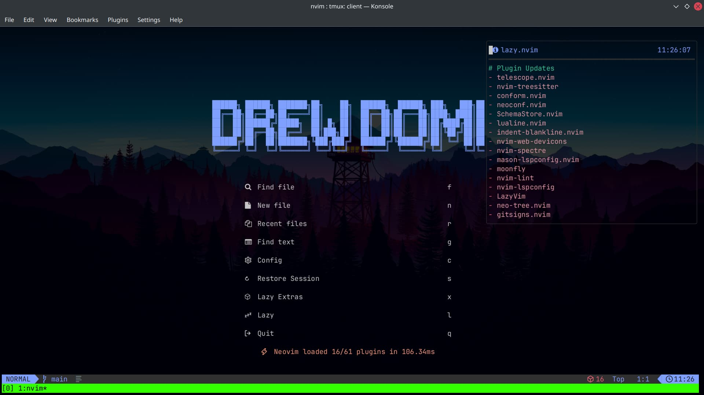

# 💤 Drew Domi's LazyVim

## Plugins

<ul>
    <li><a href="https://github.com/CRAG666/code_runner.nvim" target="_blank">Code Runner</a></li>
    <li><a href="https://github.com/norcalli/nvim-colorizer.lua" target="_blank">Colorizer</a></li>
    <li><a href="https://github.com/bluz71/vim-moonfly-colors" target="_blank">Colorscheme</a></li>
    <li><a href="https://github.com/editorconfig/editorconfig-vim" target="_blank">Editorconfig</a></li>
    <li><a href="https://github.com/iamcco/markdown-preview.nvim" target="_blank">MarkDown Preview</a></li>
    <li><a href="https://github.com/pmizio/typescript-tools.nvim" target="_blank">TypeScript Tools</a></li>
</ul>

## features

* Run code keymaps
* MDX support
* Folding
* Colorizer HEX colors
